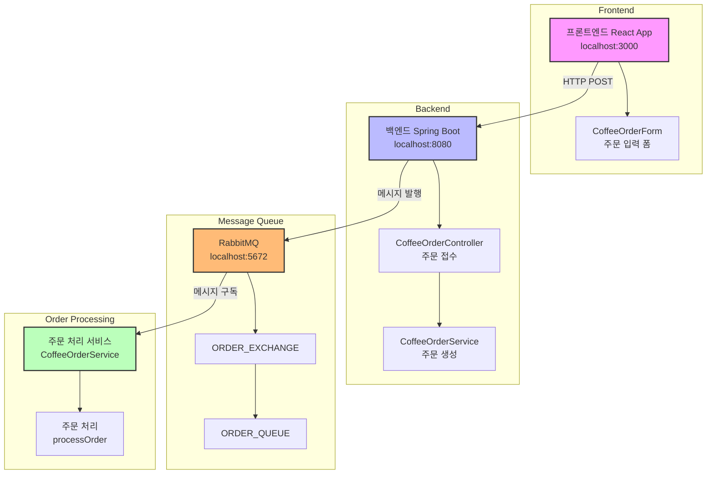

# 주요 컴포넌트 설명:
## 1. 프론트엔드 (React, 포트 3000)
### - CoffeeOrderForm: 사용자 주문 입력 폼
### - Axios를 사용하여 백엔드와 통신
## 2. 백엔드 (Spring Boot, 포트 8080)
### - CoffeeOrderController: REST API 엔드포인트 제공
### - CoffeeOrderService: 주문 생성 및 RabbitMQ로 메시지 전송
## 3. 메시지 큐 (RabbitMQ, 포트 5672)
### - ORDER_EXCHANGE: 메시지 교환기
### - ORDER_QUEUE: 주문 처리 대기열
## 4. 주문 처리 서비스
### - @RabbitListener를 통한 비동기 주문 처리
### - 주문 상태 업데이트 및 처리
## * 데이터 흐름:
### 1) 사용자가 주문 폼 작성
### 2) 프론트엔드에서 백엔드로 HTTP POST 요청
### 3) 백엔드에서 RabbitMQ로 메시지 발행
### 4) 주문 처리 서비스에서 메시지 수신 및 처리

# 시스템 구조

# 사용방법
## 1. 다운로드 받은 후에 cd frontend
## 2. npm install
## 3. npm start

## 서버실행: .\gradlew bootRun